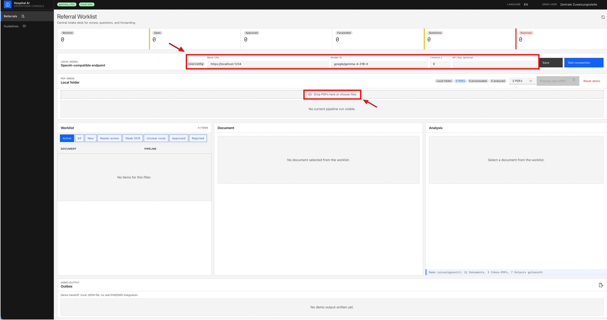

# ReferralOps: Local Gemma Assistant for Hospital Referral Intake

Local, human-reviewed administrative AI for hospital referral preparation. ReferralOps was shaped by conversations around hospital administrative pain points in Zürich: incomplete referral PDFs, scan/OCR quality issues, unclear target departments, missing contact/insurance/attachment data, and repeated back-and-forth before a case reaches the right team.

This is **not** an AI doctor. It does not diagnose, recommend treatment, decide discharge, or autonomously triage patients. It supports one administrative intake loop: extract, check, route, review, and hand off.

## Quick start

### 1. Double-click the launcher

On macOS:

```text
Start ReferralOps.command
```

On Windows:

```text
Start ReferralOps.cmd
```

The launcher checks for Python 3.12+, Node.js 22+ with npm, and Tesseract OCR. If a system dependency is missing, it asks before installing it with Homebrew on macOS or winget on Windows. Then it creates `.env` if needed, installs the repo's Python/frontend dependencies, ingests synthetic guideline demo data, starts the backend and frontend, and opens `http://127.0.0.1:5173`.

On Linux, run the same launcher flow from a terminal:

```bash
./scripts/start_judge_demo.sh
```

You still need a local OpenAI-compatible model server for model-backed referral analysis, for example vLLM, MLX LM, llama.cpp server, or LM Studio.

### Manual terminal fallback

If you do not want to double-click the launcher, run the same setup flow from a terminal at the repo root:

```bash
chmod +x ./scripts/start_judge_demo.sh
./scripts/start_judge_demo.sh
```

If the launcher itself fails and you want to start everything manually, install the system dependencies first, then run:

```bash
python3.12 -m venv .venv
source .venv/bin/activate
python -m pip install --upgrade pip
pip install -e ".[dev]"
npm --prefix frontend ci
[ -f .env ] || cp .env.local-model.example .env
python scripts/ingest_guidelines.py
```

Start the backend in one terminal:

```bash
NO_EXTERNAL_AI_CALLS=true \
BACKEND_CORS_ORIGINS=http://127.0.0.1:5173,http://localhost:5173 \
.venv/bin/uvicorn backend.app.main:app --host 0.0.0.0 --port 8000 --reload --reload-dir backend --reload-dir configs
```

Start the frontend in another terminal:

```bash
VITE_API_BASE_URL=http://127.0.0.1:8000 \
npm --prefix frontend run dev -- --host 0.0.0.0 --port 5173 --strictPort
```

Then open `http://127.0.0.1:5173`. If port `5173` is already in use, choose another frontend port, for example `5174`, and update both the frontend command and `BACKEND_CORS_ORIGINS` to use that port.

### Manual system install

Use these only if you want to install prerequisites yourself or your launcher cannot use the OS package manager.

macOS:

```bash
brew install python@3.12 node tesseract tesseract-lang
```

Windows:

```powershell
winget install -e --id Python.Python.3.12; winget install -e --id OpenJS.NodeJS.LTS; winget install -e --id UB-Mannheim.TesseractOCR
```

Debian/Ubuntu:

```bash
sudo apt-get update && sudo apt-get install -y python3.12 python3.12-venv nodejs npm tesseract-ocr tesseract-ocr-eng tesseract-ocr-deu curl
```

After a manual install, double-click the launcher again. Windows may need a new command window before updated `PATH` entries are visible.

The launcher runs the repo-local dependency setup itself, so you do not need to run `npm install` manually.

In the dashboard:

1. Open **Local Model**.
2. Enter the local model base URL, for example `http://localhost:8080/v1`, and model id, for example `google/gemma-4-31B-it`.
3. Click **Test connection**.
4. Drag the two synthetic sample PDFs from `demos/referral_inbox_samples/` into **PDF-Inbox**.
5. Set the PDF count to `2` and click **Process new PDFs**.
6. Review the worklist. One sample is complete; the other is scan-style/incomplete and should show OCR handling, missing information, evidence snippets, and **Review required**.
7. Use **Approve**, **Correct & approve**, **Ask question**, **Reject**, or **Forward** to show the auditable human review loop.

Dashboard uploads are stored in `data/referral_inbox/`. Runtime model settings are stored in `data/local_model_config.json`, which is ignored by Git. API keys are not written to that file; use `LOCAL_LLM_API_KEY` in `.env` if a local gateway requires one.



## Test result

- **500 synthetic Swiss referral PDFs** are included under `demos/referral_batch_large/pdfs/`.
- Synthetic source metadata is included in `demos/referral_batch_large/metadata.csv`.
- Local H100 VPS validation run: **85.4% top-1** and **91.8% top-3** routing accuracy on 500 PDFs with **Gemma 4 31B** served through an OpenAI-compatible local endpoint.
- The reported score uses **PDF-content-adjudicated labels**.
- The model can write a **free-text suggested destination** and the backend maps that suggestion into a controlled routing taxonomy when possible.
- No external AI calls are used for patient-like documents.
- Human review is required before handoff.
- Approved **Weiterleiten** actions write local JSON handoffs to department folders.

## Workflow

```text
PDF inbox
  -> PyPDF text extraction
  -> local Tesseract OCR fallback when needed
  -> local OpenAI-compatible Gemma endpoint
  -> compact JSON extraction with free-text destination suggestion
  -> controlled routing taxonomy mapping and completeness checks
  -> referral review worklist
  -> human approve / correct / question / reject / forward
  -> local department handoff folders
```

## Large PDF batch

The larger synthetic test set is here:

```text
demos/referral_batch_large/pdfs/                       # 500 synthetic referral PDFs
demos/referral_batch_large/metadata.csv                # synthetic source metadata
demos/referral_batch_large/pdf_adjudicated_labels.csv  # PDF-content-adjudicated labels when present
```

To test the batch in the dashboard, drag PDFs from `demos/referral_batch_large/pdfs/` into **PDF-Inbox** and process them in small batches. Do not add real patient data.

## Output folders

Review and handoff outputs are written as local JSON files:

```text
demo_outputs/referrals/confirmed/
demo_outputs/referrals/corrected/
demo_outputs/referrals/questions/
demo_outputs/referrals/rejected/
demo_outputs/referrals/writeback/<routing_target>/
demo_outputs/referrals/departments/<routing_target>/
```

This simulates hospital DMS/KIS handoff after human approval. It is not a production KIS/DMS/FHIR writeback.

## Guideline chat

The guideline assistant uses local markdown guideline sources under:

```text
demos/guideline_docs/
```

By default the guideline path uses local lexical retrieval so the referral demo only needs the generation endpoint. For local embeddings, set:

```env
EMBEDDING_PROVIDER=embeddinggemma_local
LOCAL_EMBEDDING_MODEL_PATH=/path/to/embeddinggemma
EMBEDDING_LOCAL_FILES_ONLY=true
```

## Architecture

```text
frontend/src/
  React dashboard, referral review UI, guideline chat, local model setup

backend/app/api/
  FastAPI routes

backend/app/referral/
  inbox processing, model extraction, free-text destination capture, routing mapping, validation, worklist, review, output handoff

backend/app/documents/
  PDF parsing, OCR, local/MinIO document registration

backend/app/model_gateway/
  OpenAI-compatible local LLM client, CI test double, optional local embeddings

backend/app/rag/
  local guideline ingestion, ACL-filtered retrieval, grounded answers

configs/
  users, routing targets, completeness rules, source config
```

More detail:
- `docs/live-500-pdf-review-report.md`
- `docs/architecture.md`
- `docs/data-protection.md`

## Safety boundary

- Synthetic data only.
- No external AI calls by default.
- No autonomous clinical triage.
- No diagnosis or treatment recommendation.
- No production KIS/DMS/FHIR writeback.
- Human review is required before handoff.
- Output JSON does not store full prompts, raw model output text, or full extracted document text by default.
- Demo auth uses the `X-Demo-User` header. The `password: demo` values in `configs/demo_users.yml` are placeholders for demos, not active password authentication.

Production deployment would require hospital-specific IAM, audit policy, data protection review, source-system integration, clinical governance, and formal validation.
