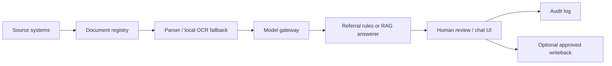

# Architecture

`hospital-ai-assistant` is a local administrative assistant layer for hospital operations. Existing DMS, KIS, archive, intranet, email, fax, and FHIR-like systems remain source systems. This repo stores references, extracted text, metadata, ACL snapshots, model suggestions, human review decisions, feedback, and audit events.

## Modules

- Referral preparation: document ingestion, PDF/DOCX/text parsing, local Tesseract OCR fallback for scanned PDFs, Gemma-compatible JSON extraction, free-text destination capture, controlled routing taxonomy mapping, completeness rules, evidence, review, and optional writeback after approval.
- Guideline RAG: source ingestion, chunking, EmbeddingGemma-compatible embeddings, ACL-filtered retrieval, source-grounded answers, no-answer guardrails, feedback, and audit.

## Runtime

- Backend: Python 3.12, FastAPI, Pydantic, SQLAlchemy.
- Demo database: SQLite by default for local speed.
- Container pilot profile: PostgreSQL with pgvector, Redis, MinIO.
- Frontend: React, Vite, TypeScript, lucide-react icons.
- Model access: all generation and embedding calls go through `backend/app/model_gateway`.

## Data Flow

## Non-Goals

- No external AI API calls for patient data.
- No autonomous clinical decision, diagnosis, therapy, discharge, or final triage.
- No broader access than the source system allows.
- No production use without hospital validation and regulatory review.
